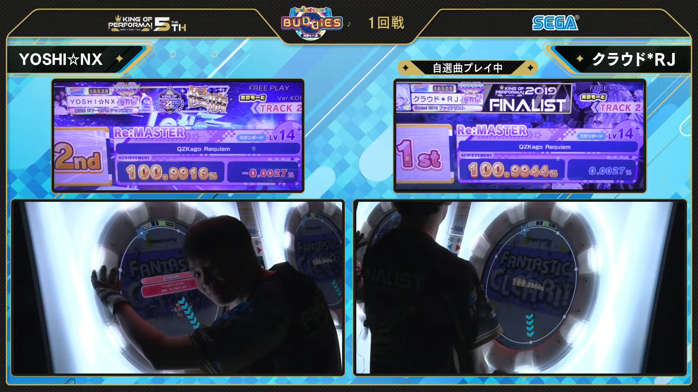
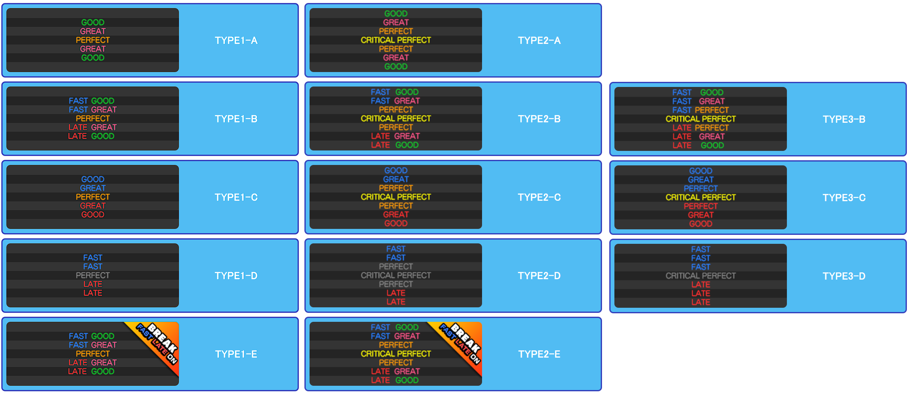

This document contains miscellaneous information, related to the other documents' contents, or the game's mechanics.

# Timing windows

The amount of time allowed to hit a note to achieve specific judgments. All values here are in milliseconds.

F = Fast, L = Late. Empty cells means that a judgment for that type of note cannot be achieved through normal play.

|Note Type|F Good|F Great Low|F Great Mid|F Great High|F Perfect Low|F Perfect High|Critical|L Perfect High|L Perfect Low|L Great High|L Great Mid|L Great Low|L Good|
|---|---|---|---|---|---|---|---|---|---|---|---|---|---|
|Tap / Hold Head|\[-150, -100)|\[-100, -83.33)|\[-83.33, -66.66)|\[-66.66, -50)|\[-50, -33.33)|\[-33.33, -16.66)|\[-16.66, 16.66]|(16.66, 33.33]|(33.33, 50]|(50, 66.66]|(66.66, 83.33]|(83.33, 100]|(100, 150]|
|ExTap / ExBreak / ExHold Head| | | | | | |\[-150, 150]| | | | | | |
|Slide|\[-∞, -433.33)|\[-433.33, -366.66)|\[-366.67, -300)|\[-300, -233.33)| | |\[-233.33, 233.33]| | |(233.33, 266.66]|(266.66, 366.67]|(366.66, 433.33]|(433.33, 600]|
|Touch/Touch Hold Head| | | | | | |\[-150, 150]|(150, 175]|(175, 200]|(200, 216.66]|(216.66, 233.33]|(233.33, 250]|(250, 300]|

You probably have noticed the different tiers within a single judgment and how the note types are named.

- Judgments are often broken into multiple tiers, to support the multi-tier scoring of Break notes. More on that in **Scoring**.
- EX notes automatically gives a Critical Perfect judgment, so long as it's hit.
- Hold notes are judged depending on how well you hit the hold, and how long you held it for.
- The above judgments for Slide notes are base values; they might increase according to their shapes and duration.

# Special notes judgment

Some notes have special judgment rules.

## Hold
Hold notes is judged based on two criterias: The hold's judgment when you hit it, and how long you've held it.

### Hold Head
The judgment is calculated according to the table above. The hold will glow to signify the judgment.
- The window to achieve specific judgments are described in the table above.
- If the player put their hand on the hold too late, the hold would glow white instead.

### Hold Length
If the player removes their hands from the hold input, the hold doesn't disappear instantly, instead it still remains till it ends, allowing the player to re-engage the hold.

If a hold is left unengaged, it will turn gray, signifying that the final judgment of the hold is decaying.
- If the hold's judgment cannot be reduced further, the color would not change.

How the final judgment is calculated is determined by the percentage of time that the hold was held.

|Judgment|Minimum Percentage of Duration|Notes|
|---|---|---|
|Critical|95%| |
|Critical -> Perfect|66.66%|Unsure what percentage to achieve the various tiers of Perfect, but this percentage gives the player Low Perfect|
|Critical/Perfect -> Great|33.33%|Unsure what percentage to achieve the various tiers of Great, but this percentage gives the player Low Great|
|Critical/Perfect -> Good|Minimal interaction with the hold||
|Great -> Good|Not tested||
|Good -> Great|See notes|As long as the remaining duration is long enough, engage the hold for 100% of the remaining duration would turn a Good into a Great; not sure what is that required percentage|

When the BPM is high enough, holds with duration of 1 tick or lower (= 1/8 of chart resolution) will count as a Critical Perfect just by touching it.

## Slides
Slides are judged based on two criterias: timing and completion.

### Slide completion

A slide would be considered "completed" if the last segment of it is cleared.
- Once a slide is "completed", the game instantly judge the slide timing-wise.
- Sometimes for very long slides, they will be judged for some time after the slide is completed.
    - [Example.](https://youtu.be/HMpjTLja1DA?si=QDA0hBk34gA21cOm&t=90) Note how the slide registers a significant moment after he finished them.
If a slide is not completed, then it is judged based on the number of slide segments left incomplete.
- If 2+ segments are incomplete, the slide is judged as Miss
    - Needs clarification, sometimes I get a Late Good despite leaving more than one slide segment incomplete
- Otherwise the slide is judged as Late Good
    - To clear any confusion, Late Great is achieved by finishing the slide a little too late

### Slide timing

Small offsets to the timing window is added to account for both these cases:
- The player follows the slide star closely, or
- the player finishes most of the slide, then tap on the last slide segment to complete it

That offset is added to both ends of the timing window, which is calculated as follows

$\frac{d \times c}{2}$

where $d$ is the slide's duration, and $c$ a constant, depending on the distance between the buttons and the slide shape.

Values for $c$ can be found in the table below. Thanks [donmai](https://listed.to/@donmai/44545/how-maimai-dx-judges-slides) for their work.

| Slide shape                      | 0/8 | 1 | 2 | 3 | 4 | 5 | 6 | 7  |
|------------------------------------|----------|--------|--------|--------|--------|--------|--------|--------|
| Straight line (-) (SI_)            |          |        | 0.1920 | 0.1793 | 0.1629 | 0.1793 | 0.1920 |        |
| Clockwise arc around the ring (<, >) (SCR)| 0.0582   | 0.4653 | 0.2326 | 0.1551 | 0.1163 | 0.0931 | 0.0775 | 0.0665 |
| Counter-clockwise arc around the ring (<, >) (SCL)  | 0.0582   | 0.0665 | 0.0775 | 0.0931 | 0.1163 | 0.1551 | 0.2326 | 0.4653 |
| Clockwise arc around the center (p) (SUR) | 0.0921   | 0.1114 | 0.1247 | 0.1436 | 0.1693 | 0.0752 | 0.0817 | 0.0840 |
| Counter-clockwise arc around the center (q) (SUL) | 0.0921   | 0.0840 | 0.0817 | 0.0752 | 0.1693 | 0.1436 | 0.1247 | 0.1114 |
| Zigzag (s, z) (SSL/SSR)            |          |        |        |        | 0.1055 |        |        |        |
| v-shape (v) (SV_)                  |          | 0.1629 | 0.1629 | 0.1629 |        | 0.1629 | 0.1629 | 0.1629 |
| Clockwise arc to the side (pp) (SXR) | 0.0734   | 0.0872 | 0.1509 | 0.0698 | 0.0698 | 0.0711 | 0.0811 | 0.0603 |
| Counter-clockwise arc to the side (qq) (SXL) | 0.0734   | 0.0603 | 0.0811 | 0.0711 | 0.0698 | 0.0698 | 0.1509 | 0.0872 |
| Grand V-shape clockwise (V) (SLR)  |          |        |        |        | 0.0960 | 0.1018 | 0.0955 | 0.0948 |
| Grand V-shape counter-clockwise (V) (SLL) | 0.0948   | 0.0955 | 0.1018 | 0.0960 |        |        |        |        |
| Fan left segment (f) (SF_)         |          |        |        |        |        | 0.1793 |        |        |
| Fan middle segment (f) (SF_)       |          |        |        |        | 0.1629 |        |        ||
| Fan right segment (f)  (SF_)       |          |        |        |0.1793  |        |        |        |        |

# Scoring 

There are two scoring components in game: Base score (100%), and bonus score from breaks (1%).

## Base score
Non-Breaks awards 80% of score for Great notes, 50% for Good notes. Missed notes awards nothing.

Break notes awards the player a more varied amount of score, depending on how the player hit it.

|Note Type|Critical|High Perfect|Low Perfect|High Great|Mid Great|Low Great|Good|Miss|
|---|---|---|---|---|---|---|---|---|
|Tap|500|500|500|400|400|400|250|0|
|Hold|1000|1000|1000|800|800|800|500|0|
|Slide|1500|1500|1500|1200|1200|1200|750|0
|Touch|500|500|500|400|400|400|250|0|
|Break|2500|2500|2500|2000|1500|1250|1000|0|

## Break bonuses
Hitting breaks awards bonuses that push your score beyond the 100% from base score.
|Critical|High Perfect|Low Perfect|High Great|Mid Great|Low Great|Good|Miss|
|---|---|---|---|---|---|---|---|
|100|75|50|40|40|40|30|0|

To calculate a player's final score, the two above components will be combined as follows:

$total\textunderscore score = \frac{base\textunderscore score\textunderscore achieved}{max\textunderscore base\textunderscore score} \times 100 + \frac{break\textunderscore bonus\textunderscore achieved}{max\textunderscore break\textunderscore bonus}$

# Utage letters

This list is a description of currently known characters used to describe an Utage chart.
- It seems that Sega charters will throw any letters into this now, duh
- I will still keep updating this as they add more letters, because why not

|Character|Transliteration|Description|Examples|
|---------|---------------|-----------|--------|
| 光 | light | All notes become Break notes where applicable.| [BREaK! BREaK! BREaK!](https://www.youtube.com/watch?v=x3g4zAb9hFg) |
| 星 | star | All tap notes become star notes. | [しゅわスパ大作戦☆](https://www.youtube.com/watch?v=5mADyriA8yw&pp=ygUi44GX44KF44KP44K544OR5aSn5L2c5oim4piGIG1haW1haQ%3D%3D) |
| 逆 | reverse | Star notes now appear at the end point of slides, instead of the start point | [おちゃめ機能](https://www.youtube.com/watch?v=krSWgZTk1cw) |
| 覚 | memorize | One star note will trigger multiple slide notes, or rather, the slides following the slide that was triggered by the star are not preceeded by a star note(s). Players have to remember the order of these slides. One could even consider this a prototype of FESTiVAL's connecting slides mechanic. | [D✪N’T ST✪P R✪CKIN’](https://www.youtube.com/watch?v=jIKX1cW7HJ0)|
| 撫 | stroke | Some slides appear without a star note. | [からくりピエロ](https://www.youtube.com/watch?v=eE-01tEzhM4)|
| 即 | instant | All slides in the chart has shorter or no delay. In some cases, the chart gets completely modified whilst having extremely high slide BPMs. | [Our Wrenally](https://www.youtube.com/watch?v=F-eMPEvT0I0)|
| 傾 | tilt | The entire chart is tilted compared to its original version. | [Back 2 Back](https://www.youtube.com/watch?v=748udBgkWr4)|
| 蛸 | octopus | In some, or most points in the chart, three or more notes would require the player to hit them at the same time. These notes could be hit by using arms, elbows, various of body parts (head, torso, etc.), spins (at the cost of [sometimes] not being able to score a Critical Perfect), or with another player. | [ミラクル・ショッピング](https://www.youtube.com/watch?v=GLWoIzvLcak)|
| 疑 | doubt | Slides have different delays depending on the star note that triggers it: A break star note means that the slide has no delay, while a normal one means the slide won't move until another tap note comes into its start point. | [DETARAME ROCK&ROLL THEORY](https://www.youtube.com/watch?v=h817XKdPHBc). Previously its letter was 宴 |
| 協 | cooperation | A chart that is recommended for two or more players. Note that this doesn't always mean the chart strictly requires two players to clear, some love-themed songs like [Love You](https://www.youtube.com/watch?v=pNawirQECZU) or [恋愛裁判](https://www.youtube.com/watch?v=f3IAruAMpmo) can be comfortably cleared and AP'd with just one player. | [Hand In Hand](https://www.youtube.com/watch?v=5Q84IHkHDAQ)|
| 宴 | banquet | Charts that belongs to multiple of above attributes, or cannot be really classified. | [Oshama Scramble!](https://www.youtube.com/watch?v=P879N5Dm0VE). Characteristics from 蛸, 撫 appears here.|
| 蔵 | warehouse | Beta charts that was scrapped due to difficulty or other reasons. Apparently, to get a chart released the note designer must score an S rank on it. | [Aegleseeker](https://www.youtube.com/watch?v=GtYixO4h7hM)|
| 狂 | insane | Charts with outright absurd difficulty, exceeding even 蔵 and 宴 charts. They are not meant to be cleared, let alone AP'd ~~until Japanese players say otherwise.~~. Some charts of this type has conditions that terminates play when a set amount of mistake was made, as a mean of weeding out the weaker players. | [タカハせ！名人マン](https://www.youtube.com/watch?v=2FUBimkytWg). This longjack monstrosity has Track Skip/SSS enabled, which translates into 5 greats, or 2.5 greats (second half) in FiNALE.|
| 耐 | endurance | Charts created to test a player's endurance, or sometimes consistency. | [Space Harrier Main Theme \[Reborn\]](https://www.youtube.com/watch?v=85CdmfDsyeQ), [CYCLES](https://www.youtube.com/watch?v=TpSBifKEfME). Notice the recurring patterns.|
| 右 | right | All notes appear on the right-hand side of the screen. Does not apply to slides (not their stars). Actually a joke accompanied with **The wheel to the right**. | [The wheel to the right](https://www.youtube.com/watch?v=hUizrk7P5Hk)|
| 回 | times, loop | Suggests a pattern that requires the player to move their hands in circles, for example, chain slides around the judgment ring, or spins. | [回る空うさぎ](https://www.youtube.com/watch?v=UwnkpsfffuU), [ダブルラリアット](https://www.youtube.com/watch?v=fUlsJA2D_u0)|
| 息 | breath | A letter assigned exclusively to ノンブレス・オブリージュ. The chart has properties of a 耐 chart. | [ノンブレス・オブリージュ](https://www.youtube.com/watch?v=yK9M9gPmsIs)|
| 奏 | concert | 協, but it's a BUDDY chart that can be cleared by one person per cabinet. | [チュルリラ・チュルリラ・ダッダッダ！](https://www.youtube.com/watch?v=hFKAqsieCaM)|
| J | J | On 6 Apr 2017, Sega decided to release five different versions of Garakuta Doll Play in the Utage folder, showing each charter's take on the song. &#10;Originally, when Utage was revived, only the first version of the chart is released as a 宴 chart, but the operator somehow gave out the wrong one (the second one). Sega quickly detected this error and revoked the chart, as well as releasing all of them in a future update as compensation (which is BUDDiES PLUS initial release). &#10;This is Jack's version of the chart. The letter was changed as well, since having multiple versions of the chart with just a single letter might be confusing. | [Garakuta Doll Play](https://www.youtube.com/watch?v=1r8TbJ954lA) |
| r | r | This is rioN's version of the chart. | [Garakuta Doll Play](https://www.youtube.com/watch?v=0LQR5rEGDbI) |
| は |  | This is Happy (はっぴー)'s  version of the chart. は is the hiragana for "ha". | [Garakuta Doll Play](https://www.youtube.com/watch?v=XGlUUZVqdIg) |
| 玉 |  | This is 玉子豆腐's version of the chart. | [Garakuta Doll Play](https://www.youtube.com/watch?v=r1C0jbBnkXE) |
| 某 |  | This is 某S氏's version of the chart. | [Garakuta Doll Play](https://www.youtube.com/watch?v=qxKTXhLREA4). Stop asking why I love using reference videos with Tsukiho's face in it |
| 奏 |  | A chart with some parts mirrored, or entirely modified. If the chart if 2P, there might be different modifications in each part of the chart. | [アンビバレンス](https://www.youtube.com/watch?v=0BD3uz0Y9P8). Except for some part in the beginning, the rest of this chart are either mirrored compared to the original Master chart. |
| 習 | practice | Serves as a tutorial to master a specific pattern or chart. | [ウミユリ海底譚](https://www.youtube.com/watch?v=Kmhd_lw1Dks). This Utage chart teaches the player the basic of the Umiyuri pattern. Note how the chart gets progressively difficult. |
| X |  | Associated with the song 人マニア. Patterns in the chart resemble a cross shape, hence the name. | [人マニア](https://youtu.be/n-IXCR0qv-c?si=k_Hp9W7glMS6-pi0) |
| 噓 | liar | Associated with the song ライアーダンサー. Star notes always come with a slide note, but aren't put at where the slides started. | [ライアーダンサー](https://www.youtube.com/watch?v=Yw4Zp6c8Q4c) |
| 爆 | burst | Chart that has a lot of touch notes that fire hanabis. Currently, the only chart with this property is [爆]Love's Theme of BADASS ～バッド・アス 愛のテーマ～. | [Love's Theme of BADASS ～バッド・アス 愛のテーマ～](https://www.youtube.com/watch?v=51vh92TeitU) |
| 片 | piece | Part of the charts that are normally supposed to be played with two hands must now be played with only one, by locking your other hand somewhere, for example a hold. Currently, the only chart with this property is [片]神々が恋した幻想郷. | [神々が恋した幻想郷](https://www.youtube.com/watch?v=rnqcJo61Ojc) |
| 甘 | sweet | Associated with the song スイートマジック. | [スイートマジック](https://www.youtube.com/watch?v=yDZknAX_Oxg) |
| 匿 | hidden, anonymous | Associated with the song 匿名M. | [匿名M](https://www.youtube.com/watch?v=hAzye3YIuQg) |
| 幸 | happy | Associated with the song 犬日和。(はっぴー歌唱Ver). This is a reference to Happy (はっぴー), the dog mascot that appears in official SEGA events. It seems whereever a dog appears in maimai, Happy will be there. [Happy even covered this song himself, and if you haven't recognized already, this is the song when you hover over random select.](https://www.youtube.com/watch?v=833zZZXEaP4) | [犬日和。(はっぴー歌唱Ver)](https://www.youtube.com/watch?v=X7AKJOcEWWk) |

# Utage fixed options
A list of options that can be applied to Utage charts.

## Track Skip
`_fixedOptionName`: `TrackSkip`

This option offers conditions to terminate the current track.
- Track Skip is only available once the first note is judged.

### Buttons
Allows the player to terminate the track by holding the buttons 2, 3, 6, 7 for three seconds.
- This is different from holding the buttons 3, 4, 5, 6 for three seconds to restart the track in Freedom Mode.

`_fixedOptionValue`: `Push`

### Rank
Terminates the track once the player's score drops below a specific amount.

|`_fixedOptionValue`|Explanation|
|---|---|
| `AutoS`    | Terminates the track once S rank (97%, 194% for BUDDY charts) is no longer achievable.|
| `AutoSS`   | Terminates the track once SS rank (99%, 198% for BUDDY charts) is no longer achievable.|
| `AutoSSS`  | Terminates the track once SSS rank (100%, 200% for BUDDY charts) is no longer achievable.|
| `AutoBest` | Terminates the track once \[player's best score] is no longer achievable.|

A phenomenon worth noting considering this option is that the player's score might fluctuate by 0.0001% while playing (e.g. score drops from 100.5000 to 100.4999, then comes back up to 100.5000 again despite the player making no mistakes). This is mostly due to [floating point trolling](https://en.wikipedia.org/wiki/Floating-point_arithmetic), and happens mostly with songs having the break note count, or total note weight divisible by 3. It's unknown whether this will trigger the track skip if the player is unfortunate enough.

### Life
The player is given a set amount of Life. Each non-Perfect deducts 1 life. When Life reaches 0, the track terminates.

Life is displayed at the center, overriding any of the player's existing settings.

In BUDDY charts, both players share the same amount of Life; if a player make a mistake, both of them will lose 1 life. Once Life reaches zero, it's game over for both of them.

`_fixedOptionValue`: `AutoLifeXXX`, with `XXX` being `1`, `10`, `50`, `100`, `300`, giving the player the respective amount of Life.

### Off
Terminating the track is impossible ~~unless you connect a keyboard to the cabinet or cut the arcade's power supply.~~ Fight to the end, my soldiers.

`_fixedOptionValue`: `Off`

## Display at Center
`_fixedOptionName`: `DispCenter`

Change the value to display at the center of the screen.

|`_fixedOptionValue`|Explanation|
|---|---|
| `Off`         | Display nothing |
| `Combo`       | Show the amount of consecutive notes that the player has cleared without missing.|
| `AchivePlus`  | Show the player's current score, increasing as notes are cleared.|
| `AchiveMinus1`| Show the player's theoretical score. Starts at 100.0000%, increases as they hit Breaks perfectly, and decreases as they make mistakes.|
| `AchiveMinus2`| Show the player's theoretical score. Starts at 101.0000%, and decreases as they make mistakes, or hitting Breaks not-critically-perfect. Well, unless you are in KoP, hitting a break perfectly is hardly a mistake.|
| `BoarderS`| Show the difference between the player's theoretical score and 97% (194% for BUDDY charts). Disappears once it falls below zero. |
| `BoarderSS`| Show the difference between the player's theoretical score and 99% (198% for BUDDY charts). Disappears once it falls below zero. |
| `BoarderSSS`| Show the difference between the player's theoretical score and 100% (200% for BUDDY charts). Disappears once it falls below zero. |
| `BoarderBest`| Show the difference between the player's theoretical score and \[player's best score]. Disappears once it falls below zero. |
| `DeluxScore`| Show the player's current DX score. |
| `DeluxScoreMinus`| Show the player's cumulative DX score loss. |
| `DeluxScoreStar`| Show the player's DX score in relation to the closest DX score milestone. |

## Judgment display

**WARNING**: This option might not be intended for use in Utage charts.

`_fixedOptionName`: `DispJudge`

Change the way judgment is displayed. This includes the range of judgment to display, Fast/Late indicators, Critical indicators, and more.
`_fixedOptionValue`: `TypeXX`. `XX` is the number and letter of a specific judge style, for example `1A`.

A brief visual guide for judge styles is in the picture below.

| Number | Meaning | Letter | Meaning |
|--------|---------|--------|---------|
| 1 | No Critical Perfect judgment display; the value for Criticals except for Breaks are sealed | A | No Fast/Late display |
| 2 | Critical Perfect judgment display; however normal Perfects are not accounted for Fast/Late breakdown | B | Fast/Late display for non-Perfect (non-Critical for type 3) |
| 3 | Critical Perfect judgment display; normal Perfects are accounted for Fast/Late breakdown | C | Simplistic display, with Good/Great judgment text color changed to Fast/Late's |
| | | D | Perfect judgment texts doesn't display; Non-Perfects are simply displayed as Fast/Late |
| | | E | Same as B, but non-critical Breaks are accounted for Fast/Late breakdown |

The above table would explain why there is no 3-A (duplicate of 2-A), or 3-E (duplicate of 3-B). 

This option has seen uses in older maimai versions, for example, in [全世界共通リズム感テスト](https://www.youtube.com/watch?v=2td8i141kcY). In this chart, notes are invisible, and Breaks judgments won't display as Perfect Fast or Perfect Late, since the judge type has been either changed to 1-B or 2-B. It is also said that the guide sound is off, too.

## Mirror
This option forcefully mirrors or rotates the chart.

|`_fixedOptionValue`|Explanation|
|---|---|
| `Off`  | Does not flip or rotate the chart. Also render player's mirroring options invalid. |
|  `LR`  |  Flips the chart vertically.|
|  `UD`  | Flips the chart horizontally.|
| `LRUD` | Applies both `LR` and `UD`. |

