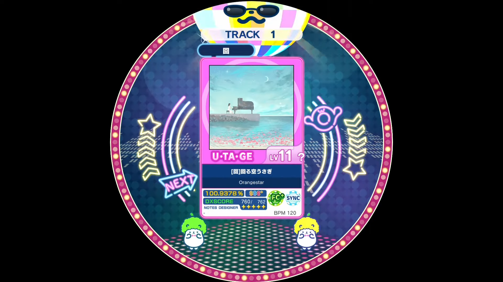
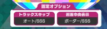

This document discusses elements specific to Utage charts.

# Overview
Utage (宴, lit. party), are unique takes on already existing charts. They can include running jokes, beta charts, and sometimes charts with difficulty beyond imagination.

One can compare it to WORLD'S END charts from CHUNITHM, or the majority of LUNATIC charts from オンゲキ.

## How to unlock
In the latest version (maimai DX BUDDiES), Utage charts are located in the 宴会場 (lit. banquet hall) folder. To access, the player's (1-Player Mode) or both player's (2-Player Mode) ratings must add up to 10000. 

Once this condition is fulfilled, the game will let the unlocking player(s) know with a notification on-screen. The folder will then be permanently unlocked for said players, even though their ratings drop below 10000 due to a major version update, or each one's individual rating is less than 10000.

# Utage-specific indications

When a chart is determined an Utage chart, there are some indicators that must be set accordingly.

## In charts
The flag [`FES_MODE`](Charts.md#FES_MODE) must be set to 1.

## The level ID

As maimai DX [determines a chart's type using the level ID](Music.md#name), the level ID's first two digits must be set to 1X (X=0-9) so that the chart appears in the Utage folder.

## BUDDY charts
Starting from maimai DX BUDDiES, there are special Utage charts that can only be played in 2-Player Mode. Both players will take part in playing the chart, with each one playing a completely different version of the chart. The maximum achievable score thus also increases to 202.0000%.

To accomodate this change:
- Set the tag [utagePlayStyle](Music.md#utagePlayStyle) to 1.
    - If so, the chart will be locked in 1-Player Mode.
- Make two charts within the folder containing the Music.xml:
    - Name the chart to be played on the 1P-side `chart_name_L.ma2`,
	- and the chart to be played on the 2P-side `chart_name_R.ma2`.

## Utage letter

Each Utage chart's theme is determined by a single kanji letter. 

Defines it in the tag [utageKanjiName](Music.md#utageKanjiName). 

Due to the recent updates, there are many more letters being used as description for Utage charts. Description of each letters will be discussed in the [Appendix](Appendix.md).

## Fixed options

There can be up to four options to be applied to any Utage chart, overriding the player's own settings. They are displayed above the song jacket in song select.

These can be set in the `fixedOption` tags. 

This document will only discuss the `_fixedOptionName` component of the above tag; values for `_fixedOptionValue` will be included in the [Appendix](Appendix.md).

### Track Skip

This option allows the player to instantly terminate the track when conditions are met, or by using a certain button combination.
- `_fixedOptionName`: `TrackSkip`

### Mirror

This option forcefully rotates or flips the chart.
- `_fixedOptionName`: `Mirror`

### Display at Center
This option changes the value to be displayed at the center.
- `_fixedOptionName`: `DispCenter`

Some options that are not intended to be used will also be discussed in the [Appendix](Appendix.md).
